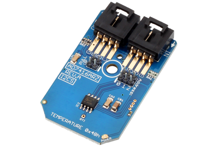

[](https://www.controleverything.com/content/Analog-Digital-Converters?sku=AD7416ARZ_I2CS)
# AD7416ARZ
AD7416ARZ Temperature Sensor

The AD7416ARZ device offers high-accuracy digital temperature measurement.

This Device is available from ControlEverything.com [SKU:AD7416ARZ_I2CS]

https://www.controleverything.com/content/Analog-Digital-Converters?sku=AD7416ARZ_I2CS

This Sample code can be used with Raspberry pi, Arduino, Particle and Beaglebone Black.

## Java
Download and install pi4j library on Raspberry pi. Steps to install pi4j are provided at:

http://pi4j.com/install.html

Download (or git pull) the code in pi.

Compile the java program.
```cpp
$> pi4j AD7416ARZ.java
```

Run the java program.
```cpp
$> pi4j AD7416ARZ
```

## Python
Download and install smbus library on Raspberry pi. Steps to install smbus are provided at:

https://pypi.python.org/pypi/smbus-cffi/0.5.1

Download (or git pull) the code in pi. Run the program.

```cpp
$> python AD7416ARZ.py
```

## Arduino
Download and install Arduino Software (IDE) on your machine. Steps to install Arduino are provided at:

https://www.arduino.cc/en/Main/Software

Download (or git pull) the code and double click the file to run the program.

Compile and upload the code on Arduino IDE and see the output on Serial Monitor.


## Particle Photon

Login to your Photon and setup your device according to steps provided at:

https://docs.particle.io/guide/getting-started/connect/photon/

Download (or git pull) the code. Go to online IDE and copy the code.

https://build.particle.io/build/

Verify and flash the code on your Photon. Code output is shown in logs at dashboard:

https://dashboard.particle.io/user/logs


## C

Download (or git pull) the code in Beaglebone Black.

Compile the c program.
```cpp
$>gcc AD7416ARZ.c -o AD7416ARZ
```
Run the c program.
```cpp
$>./AD7416ARZ
```
#####The code output is temperature reading in degree celsius and fahrenheit.
